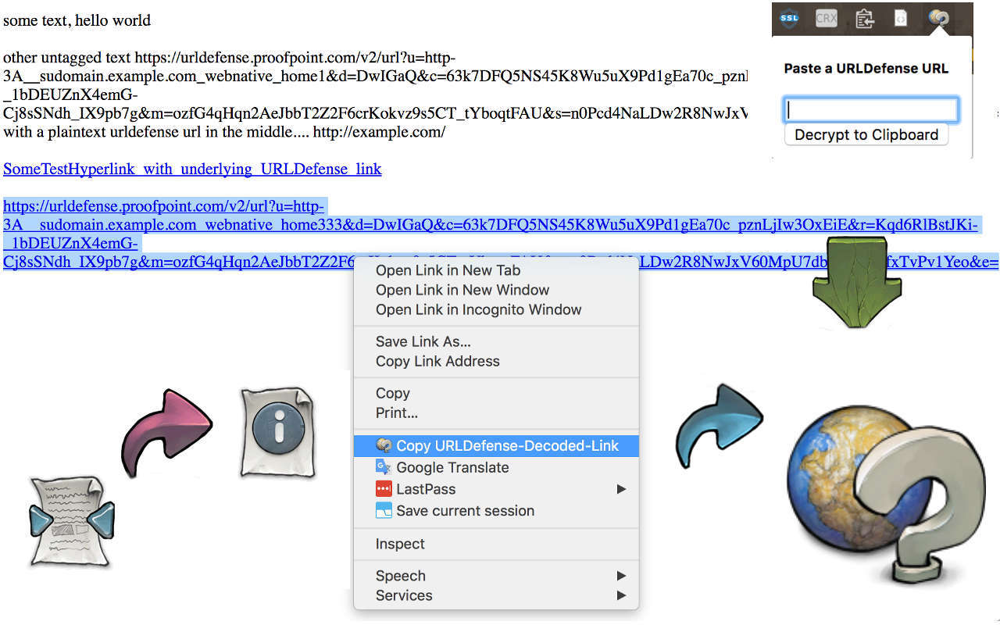

# URLDefenseDecoder  

 URLDefenseDecoder is a Chrome Extension which provides the ability to "copy a decoded Proofpoint URLDefense URL to clipboard via Chrome's right-click context menu."

## Usage
Right-Click a URLDefense encoded URL, or triple-click-select-all of a plaintext URLDefense URL, and right-click to get a Chrome Context Menu option called "Copy URLDefense-Decoded-Link". Click that menu item and the link will be copied to your clipboard.

Or you can also manually paste encoded urls into the extension popup box from the toolbar.

## A Note on Permissions

## Known/Potential Issues

All of which should be cleaned up in due time...
1. Nested context menu entries occur when selecting a hyperlink and having already selected, and/or still highlighting, a previous URLDefense URL.
2. Code is not commented, there's no error handling/logging, sorry
3. I've only tested for /v2 URLs as I don't have access to /v1 Proofpoint, but I assume /v1 will work. And it has not been tested with outrageously complex syntax, but it should work well.

[Please report issues!](https://github.com/TryTryAgain/URLDefenseDecoder/issues)

## Contributing

1. Fork it!
2. Create your feature branch: `git checkout -b my-new-feature`
3. Commit your changes: `git commit -am 'Add some feature, fixed XYZ bugs.'`
4. Push to the branch: `git push origin my-new-feature`
5. Submit a pull request :D

## Changelog

#### 2017-07-28
v0.0.2 - Bug Fixes and Enhancements

- Now the context menu only shows up when selecting a URLDefense URL
- The duplicate/nested context menu entries for hyperlinks no longer shows up (granted you're not encountering a newly discovered bug)
- The popup can now be used for manual decoding of pasted URLDefense URLs
- New icon, higher resolution support
- Dedicated [CHANGELOG](CHANGELOG.md) file

#### 2017-07-26
v0.0.1 - Initial Commit

## Credits/Licenses

Chrome Extension: [Michael Lawler](https://github.com/TryTryAgain)
- Released under [GNU GPLv3](https://www.gnu.org/licenses/gpl-3.0.en.html)

Icon Artwork: Paul Davey aka [Mattahan @ DeviantArt](http://mattahan.deviantart.com/art/Buuf-37966044)
  - [All Rights Reserved.](https://creativecommons.org/licenses/by-nc-sa/2.5/)

[Original Python Implementation](https://help.proofpoint.com/@api/deki/files/177/URLDefenseDecode.py?revision=1) and Inspiration
